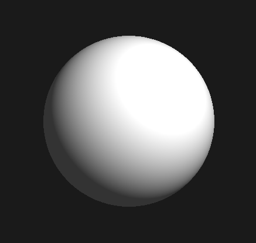
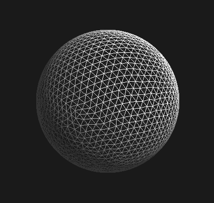
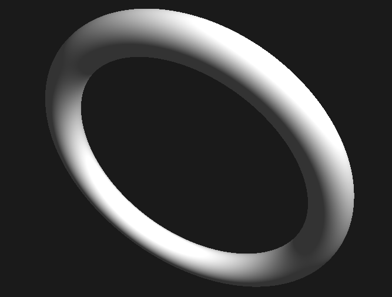
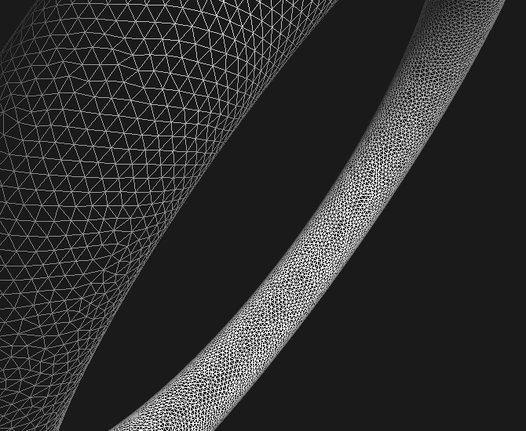
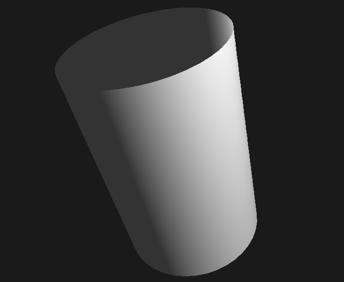
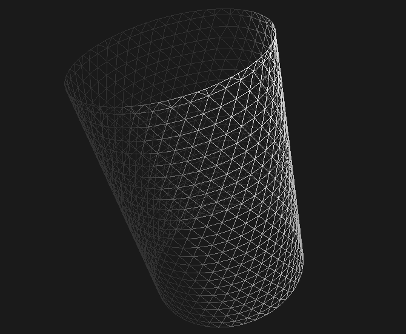
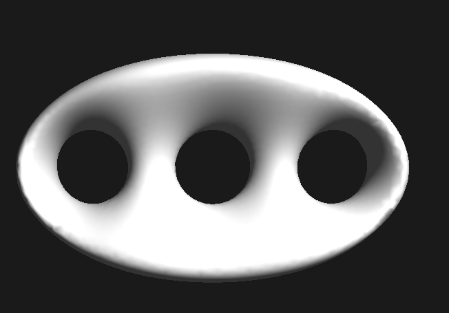
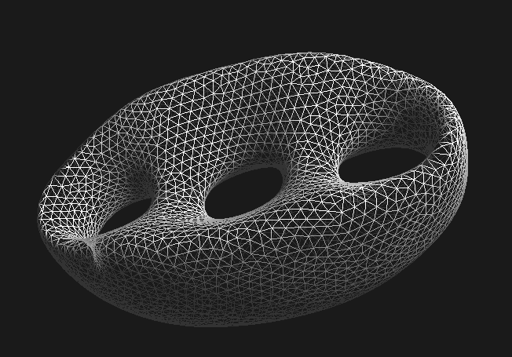

# 3D Grapher

Program taking advantage of marching triangles algorithm for rendering 3D figures specified by implicit equations.

$x^2+y^2+z^2=16$

  
  

$(\sqrt{x^2+y^2}-10)^2+z^2=25$

  
  

$x^2 + y^2 = 4$

  
  

$(1-(\frac{x}{6})^2-(\frac{y}{3.5})^2)((x-3.9)^2+y^2-1.2^2)(x^2+y^2-1.2^2)((x+3.9)^2+y^2-1.2^2)=16^2 z^2$

  
  

#### To Do:
- antialiasing
- better GUI
